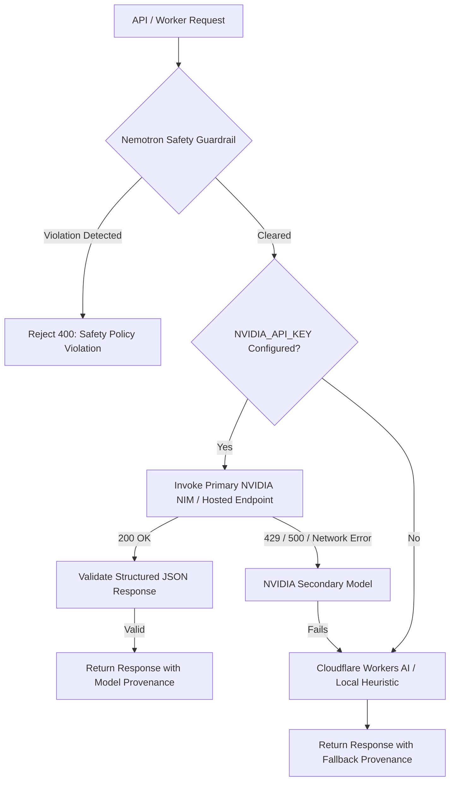

# NVIDIA Model Inventory & Architectural Integration Matrix

## Executive Overview

This document provides the authoritative technical inventory, runtime characteristics, and architectural role mapping for the 17 NVIDIA API and NIM models imported into IntelliHire.

All models integrate into IntelliHire's hybrid Cloudflare Pages (TypeScript/Hono) and Python services architecture with zero committed credentials, deterministic fallback routers, and adherence to IntelliHire's constitutional governance invariants:
1. **The Human Authority Invariant (M05)**: AI models generate observations, assessments, and draft summaries; hiring, advancement, and rejection decisions strictly require human recruiters and hiring managers.
2. **Biometric & Affective AI Prohibition (M04)**: Models used in speech pipelines perform verbatim speech-to-text transcription and question speech synthesis only. Scoring emotion, vocal pitch, facial expressions, micro-movements, or inferring personality from physical traits is strictly forbidden.
3. **Evidence-First Provenance (M01/M05)**: Candidate claims must be backed by observable evidence, separating extracted facts from probabilistic model interpretations.

---

## 1. Comprehensive Model Matrix (17 Models)

| # | Model ID | Primary Capability | Availability Type | Auth & Endpoint Route | Max Context / Output | IntelliHire Module Mapping | Role & Access Tier |
|---|---|---|---|---|---|---|---|
| 1 | `google/paligemma` | VLM (Vision-Language) | Hosted API & NIM Container | `https://ai.api.nvidia.com/v1/vlm/google/paligemma` | 512 tokens out / 180KB image | **M01** (Resume Studio) & **M03** (Work Rounds) | Evaluator / Internal (Portfolio & UI Inspect) |
| 2 | `nvidia/chatterbox-multilingual-tts` | Audio TTS (Text-to-Speech) | Hosted API & NIM Container | `https://integrate.api.nvidia.com/v1/audio/speech` | Max 1000 chars / WAV stream | **M04** (Candidate Interview) | Candidate-Facing (Interviewer Voice) |
| 3 | `deepseek-ai/deepseek-v4.1-flash` | Multimodal Fast LLM | Hosted API & NGC Weights | `https://integrate.api.nvidia.com/v1/chat/completions` | 262,144 tokens context | **M03** (Technical Work Rounds) | Candidate & Evaluator (High-speed Code Verification) |
| 4 | `google/diffusiongemma-26b-a4b-it` | Multimodal Reasoning LLM | Hosted API & HuggingFace | `https://integrate.api.nvidia.com/v1/chat/completions` | 4,096 tokens out (Thinking mode) | **M03** (System Architecture Rounds) | Evaluator (Diagram & Whiteboard Analysis) |
| 5 | `google/gemma-4-31b-it` | Instruction LLM | Hosted API & HuggingFace | `https://integrate.api.nvidia.com/v1/chat/completions` | 1,024 tokens out (Temp 0.5) | **M02** (Skill Assessments) | Evaluator (Item Generation & Rubric Calibration) |
| 6 | `moonshotai/kimi-k3` | Deep Reasoning VLM | Hosted API | `https://integrate.api.nvidia.com/v1/chat/completions` | 16,384 tokens (`reasoning_effort: max`) | **M03** (Technical Work Rounds) | Evaluator (Complex Algorithmic Verification) |
| 7 | `meta/llama-3.1-8b-instruct` *(kumo)* | Tabular & Fast Reasoning | Hosted API & NIM Container | `https://integrate.api.nvidia.com/v1/chat/completions` | 8,192 tokens context | **M01** & **M02** (Metric Synthesis) | Evaluator (Scorecard & Tabular Aggregation) |
| 8 | `nvidia/llama-3.1-nemotron-safety-guard-8b-v3` | Safety & Content Guardrail | Hosted API & NIM Container | `https://integrate.api.nvidia.com/v1/chat/completions` | 4,096 tokens context | **Cross-Cutting (M01-M05)** | System Governance (Prompt Injection & Policy Check) |
| 9 | `meta/muse-glimmer-30b` | Structured Evaluation LLM | Hosted API & NIM Container | `https://integrate.api.nvidia.com/v1/chat/completions` | 2,048 tokens out (Temp 0.0) | **M01** (Extraction) & **M02** (Assessment) | Evaluator & Extraction Engine |
| 10 | `nvidia/nemotron-3-embed-1b` | Text Embeddings | Hosted API & NIM Container | `https://integrate.api.nvidia.com/v1/embeddings` | 2,048 dim / 8,192 tokens | **M01** & **M02** (Semantic Search) | System Internal (Taxonomy Alignment & RAG) |
| 11 | `nvidia/nemotron-3-nano-omni-30b-a3b-reasoning` | Cognitive Reasoning LLM | Hosted API & NIM Container | `https://integrate.api.nvidia.com/v1/chat/completions` | 65,536 tokens (`reasoning_budget: 16k`) | **M03** (Adaptive Work Rounds) | Candidate & Evaluator (Misconception & Debrief) |
| 12 | `nvidia/nemotron-3-ultra-550b-a55b` | MoE Frontier LLM | Downloadable NIM / Cloud Partner | `https://integrate.api.nvidia.com/v1/chat/completions` | 16,384 tokens (Thinking mode) | **M03** & **M05** (Executive Benchmarks) | Evaluator (Senior/Staff Level Complex Review) |
| 13 | `nvidia/nemotron-3.5-lightning-30b-a3b` | Low-Latency MoE LLM | Hosted API & NIM Container | `https://integrate.api.nvidia.com/v1/chat/completions` | 16,384 tokens (Reasoning stream) | **M03** (Interactive Tutor) | Candidate-Facing (Real-Time Work Round Tutor) |
| 14 | `nvidia/nemotron-ocr-v2` | Computer Vision OCR | Hosted API (`/cv/`) & NIM | `https://ai.api.nvidia.com/v1/cv/nvidia/nemotron-ocr-v2` | Max 180KB b64 / Assets API | **M01** (Resume Studio) | Candidate-Facing (Scanned PDF/Cert Ingestion) |
| 15 | `nvidia/nemotron-parse-2.0` | Document Structure VLM | Hosted API & NIM Container | `https://integrate.api.nvidia.com/v1/chat/completions` | 1,024 tokens (Markdown + BBox) | **M01** (Resume Studio) | Candidate-Facing (Multi-column Resume Parser) |
| 16 | `nvidia/parakeet-tdt-0.6b` | ASR Speech Recognition | Hosted API & NIM Container | `https://integrate.api.nvidia.com/v1/audio/transcriptions` | 16kHz WAV/MP3 Audio | **M04** (Candidate Interview) | Candidate-Facing (Verbatim Speech-to-Text) |
| 17 | `riva-translate-4b-instruct-v2` | Multilingual Translation | Hosted API & NIM Container | `https://integrate.api.nvidia.com/v1/chat/completions` | 1,024 tokens out (Temp 0.2) | **Cross-Cutting (M01-M04)** | Candidate-Facing (Multilingual Localization) |

---

## 2. Detailed Technical Profiles by Model

### 1. `google/paligemma`
- **Upstream Source**: Google / NVIDIA NGC Catalog (`google/paligemma`)
- **Capability**: Vision-Language multimodal understanding.
- **Availability**: Hosted NVIDIA API endpoint + Dockerized NIM container.
- **Authentication**: `Authorization: Bearer ${NVIDIA_API_KEY}`, `Accept: application/json`.
- **Endpoint**: `https://ai.api.nvidia.com/v1/vlm/google/paligemma`
- **Modalities**: Image (JPEG/PNG up to 180KB base64) + Text prompt.
- **Parameters**: `max_tokens: 512`, `temperature: 1.0`, `top_p: 0.7`.
- **Runtime Dependencies**: Python `requests`, Node `fetch`.
- **Licensing**: Gemma Terms of Use (Permits commercial and research use).
- **IntelliHire Integration**:
  - **Module M01**: Validates visual artifacts attached to candidate profiles (certifications, portfolio designs).
  - **Module M03**: Verifies candidate UI work-surfaces (e.g. web mockups, CSS layout implementations).

### 2. `nvidia/chatterbox-multilingual-tts`
- **Upstream Source**: NVIDIA Riva Speech AI (`nvidia/chatterbox-multilingual-tts`)
- **Capability**: Neural Text-to-Speech synthesis across multiple languages.
- **Availability**: Hosted NVIDIA API endpoint + Riva NIM Speech Service container.
- **Authentication**: `Authorization: Bearer ${NVIDIA_API_KEY}`.
- **Endpoint**: `https://integrate.api.nvidia.com/v1/audio/speech`
- **Payload Schema**: `{"model": "nvidia/chatterbox-multilingual-tts", "input": text, "voice": "default", "language": "en-US", "response_format": "wav"}`.
- **Output**: Binary WAV stream.
- **Runtime Dependencies**: Python `urllib` / `requests`, Node `fetch` (`response.arrayBuffer()`).
- **Licensing**: NVIDIA Open Model License / NVIDIA AI Enterprise Terms.
- **IntelliHire Integration**:
  - **Module M04**: Powers conversational verbal interview prompts. Enables accessible text-to-speech without cloud vendor lock-in.

### 3. `deepseek-ai/deepseek-v4.1-flash`
- **Upstream Source**: DeepSeek AI / NVIDIA API Catalog (`deepseek-ai/deepseek-v4.1-flash`)
- **Capability**: Ultra-high-speed multimodal reasoning and code evaluation.
- **Availability**: Hosted NVIDIA API endpoint.
- **Authentication**: OpenAI SDK (`base_url="https://integrate.api.nvidia.com/v1"`, `api_key=NVIDIA_API_KEY`).
- **Endpoint**: `https://integrate.api.nvidia.com/v1/chat/completions`
- **Modalities**: Text + Image.
- **Constraints**: Ultra-long context up to 262,144 tokens. Max tokens output: configurable.
- **Runtime Dependencies**: Python `openai`, Node `fetch` / OpenAI SDK.
- **Licensing**: DeepSeek Open License (Commercial permissible).
- **IntelliHire Integration**:
  - **Module M03**: Evaluates complex programming codebases, multi-file submissions, and comprehensive test harness outputs with near-zero latency.

### 4. `google/diffusiongemma-26b-a4b-it`
- **Upstream Source**: Google / NVIDIA NGC Catalog (`google/diffusiongemma-26b-a4b-it`)
- **Capability**: Instruction-tuned multimodal model with native thinking capability (`chat_template_kwargs: {"enable_thinking": True}`).
- **Availability**: Hosted NVIDIA API endpoint + Self-hosted HuggingFace weights.
- **Authentication**: `Authorization: Bearer ${NVIDIA_API_KEY}`.
- **Endpoint**: `https://integrate.api.nvidia.com/v1/chat/completions`
- **Modalities**: Multimodal (Text + Diagrams).
- **Runtime Dependencies**: Python `requests`, Node `fetch`.
- **Licensing**: Gemma Terms of Use.
- **IntelliHire Integration**:
  - **Module M03**: Assesses system architecture whiteboard diagrams, entity-relationship models, and sequence charts in Engineering work rounds.

### 5. `google/gemma-4-31b-it`
- **Upstream Source**: Google / NVIDIA NGC Catalog (`google/gemma-4-31b-it`)
- **Capability**: High-capacity general instruction model for deterministic formatting.
- **Availability**: Hosted NVIDIA API endpoint.
- **Authentication**: `Authorization: Bearer ${NVIDIA_API_KEY}`.
- **Endpoint**: `https://integrate.api.nvidia.com/v1/chat/completions`
- **Parameters**: `temperature: 0.5`, `top_p: 1.0`, `max_tokens: 1024`.
- **Runtime Dependencies**: Python `requests`, Node `fetch`.
- **Licensing**: Gemma Terms of Use.
- **IntelliHire Integration**:
  - **Module M02**: Generates validated assessment items with deterministic answer rubrics across technical and non-technical domains.

### 6. `moonshotai/kimi-k3`
- **Upstream Source**: Moonshot AI / NVIDIA API Catalog (`moonshotai/kimi-k3`)
- **Capability**: Extended cognitive chain-of-thought reasoning (`reasoning_effort: "max"`).
- **Availability**: Hosted NVIDIA API endpoint.
- **Authentication**: `Authorization: Bearer ${NVIDIA_API_KEY}`.
- **Endpoint**: `https://integrate.api.nvidia.com/v1/chat/completions`
- **Parameters**: `max_tokens: 16384`, `temperature: 1.0`, `reasoning_effort: "max"`.
- **Runtime Dependencies**: Python `requests`, Node `fetch`.
- **Licensing**: Moonshot AI Community Terms.
- **IntelliHire Integration**:
  - **Module M03**: Dissects algorithmic edge cases and proofs in candidate code submissions, generating step-by-step logic corrections.

### 7. `meta/llama-3.1-8b-instruct` *(Tabular / Kumo profile)*
- **Upstream Source**: Meta AI / NVIDIA NGC Catalog (`meta/llama-3.1-8b-instruct`)
- **Capability**: Fast instruction following optimized for tabular and structured numerical evaluation.
- **Availability**: Hosted NVIDIA API endpoint + Dockerized NIM container.
- **Authentication**: OpenAI SDK / REST HTTP.
- **Endpoint**: `https://integrate.api.nvidia.com/v1/chat/completions`
- **Constraints**: 8k context window, low memory footprint.
- **Runtime Dependencies**: Python `urllib` / `openai`, Node `fetch`.
- **Licensing**: Llama 3.1 Community License.
- **IntelliHire Integration**:
  - **Module M01 & M02**: Synthesizes tabular ATS scoring dimensions (keyword coverage, structural depth, format compliance).

### 8. `nvidia/llama-3.1-nemotron-safety-guard-8b-v3`
- **Upstream Source**: NVIDIA AI Safety Research (`nvidia/llama-3.1-nemotron-safety-guard-8b-v3`)
- **Capability**: Dedicated Enterprise Safety, PII Redaction, and Prompt Injection Moderation.
- **Availability**: Hosted NVIDIA API endpoint + Dockerized NIM container.
- **Authentication**: OpenAI SDK (`base_url="https://integrate.api.nvidia.com/v1"`).
- **Endpoint**: `https://integrate.api.nvidia.com/v1/chat/completions`
- **Modalities**: Text in / Safety classification JSON out.
- **Runtime Dependencies**: Python `openai`, Node `fetch`.
- **Licensing**: NVIDIA Open Model License.
- **IntelliHire Integration**:
  - **System Governance (M01-M05)**: Pre-scans candidate inputs across all work surfaces and resumes for jailbreaks, adversarial inputs, and PII leakage before LLM ingestion.

### 9. `meta/muse-glimmer-30b`
- **Upstream Source**: Meta / NVIDIA API Catalog (`meta/muse-glimmer-30b`)
- **Capability**: High-precision JSON extraction and structured rubric evaluation.
- **Availability**: Hosted NVIDIA API endpoint + NGC Weights.
- **Authentication**: OpenAI SDK / HTTP REST.
- **Endpoint**: `https://integrate.api.nvidia.com/v1/chat/completions`
- **Parameters**: `temperature: 0.0`, `max_tokens: 2048`.
- **Runtime Dependencies**: Python `openai`, Node `fetch`.
- **Licensing**: Llama / Muse Community Terms.
- **IntelliHire Integration**:
  - **Module M01**: Primary model for Multi-Pass Resume Segmentation and Entity Extraction.
  - **Module M02**: Primary model for Objective & Subjective Rubric Evaluation.

### 10. `nvidia/nemotron-3-embed-1b`
- **Upstream Source**: NVIDIA NeMo Retriever (`nvidia/nemotron-3-embed-1b`)
- **Capability**: Dense semantic vector embeddings (1024/2048 dimensions).
- **Availability**: Hosted NVIDIA API endpoint + NeMo Retriever NIM.
- **Authentication**: OpenAI SDK (`client.embeddings.create`).
- **Endpoint**: `https://integrate.api.nvidia.com/v1/embeddings`
- **Constraints**: Max input: 8,192 tokens.
- **Runtime Dependencies**: Python `openai`, Node `fetch`.
- **Licensing**: NVIDIA Open Model License.
- **IntelliHire Integration**:
  - **Module M01 & M02**: Computes dense vector embeddings for candidate resume skills to align against the O*NET / ESCO job taxonomy with cosine similarity.

### 11. `nvidia/nemotron-3-nano-omni-30b-a3b-reasoning`
- **Upstream Source**: NVIDIA NeMo Omniverse Reasoning (`nvidia/nemotron-3-nano-omni-30b-a3b-reasoning`)
- **Capability**: Extended reasoning model with dedicated `reasoning_budget: 16384` parameter.
- **Availability**: Hosted NVIDIA API endpoint + NeMo NIM container.
- **Authentication**: `Authorization: Bearer ${NVIDIA_API_KEY}`.
- **Endpoint**: `https://integrate.api.nvidia.com/v1/chat/completions`
- **Parameters**: `max_tokens: 65536`, `reasoning_budget: 16384`, `temperature: 0.6`.
- **Runtime Dependencies**: Python `requests`, Node `fetch`.
- **Licensing**: NVIDIA Open Model License.
- **IntelliHire Integration**:
  - **Module M03**: Core engine for Continuous Adaptive Work Rounds. Analyzes candidate cognitive process, pinpoints misconceptions, and generates constructive teaching debriefs.

### 12. `nvidia/nemotron-3-ultra-550b-a55b`
- **Upstream Source**: NVIDIA NeMo Frontier Research (`nvidia/nemotron-3-ultra-550b-a55b`)
- **Capability**: Ultra-scale 550B MoE frontier model with reasoning trace streaming (`reasoning_content` delta).
- **Availability**: Cloud partner endpoints (Azure/AWS NVIDIA DGX Cloud) + Self-hosted multi-node NIM cluster (8x H100+).
- **Authentication**: OpenAI SDK streaming client.
- **Endpoint**: `https://integrate.api.nvidia.com/v1/chat/completions`
- **Parameters**: `stream: True`, `extra_body={"chat_template_kwargs":{"enable_thinking":True}}`.
- **Runtime Dependencies**: Python `openai`, Node streaming client.
- **Licensing**: NVIDIA Commercial License / DGX Cloud Agreement.
- **IntelliHire Integration**:
  - **Module M03 & M05**: Reserved for high-stakes executive assessment benchmarks, complex system trade-off grading, and offline reference validation.

### 13. `nvidia/nemotron-3.5-lightning-30b-a3b`
- **Upstream Source**: NVIDIA NeMo Low-Latency (`nvidia/nemotron-3.5-lightning-30b-a3b`)
- **Capability**: Low-latency MoE model optimized for real-time interactive streaming.
- **Availability**: Hosted NVIDIA API endpoint + Dockerized NIM container.
- **Authentication**: OpenAI SDK streaming client.
- **Endpoint**: `https://integrate.api.nvidia.com/v1/chat/completions`
- **Parameters**: `reasoning_budget: 16384`, `max_tokens: 16384`, `temperature: 1.0`.
- **Runtime Dependencies**: Python `openai`, Node streaming client.
- **Licensing**: NVIDIA Open Model License.
- **IntelliHire Integration**:
  - **Module M03**: Provides live inline candidate guidance, execution hints, and syntax remediation during live coding work rounds.

### 14. `nvidia/nemotron-ocr-v2`
- **Upstream Source**: NVIDIA Computer Vision & Document AI (`nvidia/nemotron-ocr-v2`)
- **Capability**: High-resolution OCR for scanned documents, certificates, and multi-lingual text images.
- **Availability**: Hosted NVIDIA API endpoint (`https://ai.api.nvidia.com/v1/cv/nvidia/nemotron-ocr-v2`).
- **Authentication**: `Authorization: Bearer ${NVIDIA_API_KEY}`, `Accept: application/json`.
- **Constraints**: Max image size 180KB via inline base64 (or Assets API for larger scans).
- **Runtime Dependencies**: Python `requests`, Node `fetch`.
- **Licensing**: NVIDIA AI Enterprise Terms.
- **IntelliHire Integration**:
  - **Module M01**: Extracts raw text from legacy scanned PDF resumes and credential attachments.

### 15. `nvidia/nemotron-parse-2.0`
- **Upstream Source**: NVIDIA NeMo Retriever Parse (`nvidia/nemotron-parse-2.0`)
- **Capability**: Structured document parser producing Markdown, bounding boxes, and semantic layout tags (`<predict_bbox><predict_classes><output_markdown>`).
- **Availability**: Hosted NVIDIA API endpoint + NeMo Retriever NIM.
- **Authentication**: OpenAI SDK (`model="nvidia/nemotron-parse-2.0"`).
- **Endpoint**: `https://integrate.api.nvidia.com/v1/chat/completions`
- **Parameters**: `temperature: 0.0`, `max_tokens: 1024`.
- **Runtime Dependencies**: Python `openai`, Node `fetch`.
- **Licensing**: NVIDIA Open Model License.
- **IntelliHire Integration**:
  - **Module M01**: Deconstructs complex two-column and tabular resumes into semantically intact Markdown hierarchies.

### 16. `nvidia/parakeet-tdt-0.6b`
- **Upstream Source**: NVIDIA NeMo Speech AI (`nvidia/parakeet-tdt-0.6b` / `parakeet-rnnt`)
- **Capability**: Fast Time-Depth-Transducer (TDT) Automatic Speech Recognition (ASR).
- **Availability**: Hosted NVIDIA API endpoint + Riva ASR NIM container.
- **Authentication**: OpenAI-compatible audio transcriptions route or Riva gRPC endpoint.
- **Endpoint**: `https://integrate.api.nvidia.com/v1/audio/transcriptions`
- **Input**: 16kHz WAV/FLAC audio buffers.
- **Runtime Dependencies**: Python `openai` / `requests`, Node `fetch`.
- **Licensing**: NVIDIA Open Model License / Apache 2.0.
- **IntelliHire Integration**:
  - **Module M04**: Transcribes candidate verbal answers into text with high domain vocabulary accuracy. **Invariant Enforced**: Verbatim speech-to-text only; zero emotion or confidence scoring.

### 17. `riva-translate-4b-instruct-v2`
- **Upstream Source**: NVIDIA Riva Translation AI (`riva-translate-4b-instruct-v2`)
- **Capability**: Accurate multilingual domain translation across 50+ languages.
- **Availability**: Hosted NVIDIA API endpoint + Riva Translation NIM.
- **Authentication**: `Authorization: Bearer ${NVIDIA_API_KEY}`.
- **Endpoint**: `https://integrate.api.nvidia.com/v1/chat/completions`
- **Parameters**: `temperature: 0.2`, `max_tokens: 1024`.
- **Runtime Dependencies**: Python `requests`, Node `fetch`.
- **Licensing**: NVIDIA Open Model License.
- **IntelliHire Integration**:
  - **Cross-Cutting**: Translates job descriptions, skill competencies, and candidate debriefs to empower non-native English speakers.

---

## 3. High-Availability Fallback Router Architecture

IntelliHire implements a multi-tier fallback architecture:



---

## 4. Environment Configuration (`.env.example`)

```bash
# NVIDIA Cloud API / NIM Host
NVIDIA_API_KEY=nvapi-your-key-here
NVIDIA_BASE_URL=https://integrate.api.nvidia.com/v1
NVIDIA_TTS_URL=https://integrate.api.nvidia.com/v1/audio/speech

# Default Model Selection
NVIDIA_DEFAULT_MODEL=meta/muse-glimmer-30b
NVIDIA_REASONING_MODEL=nvidia/nemotron-3-nano-omni-30b-a3b-reasoning
NVIDIA_GUARDRAIL_MODEL=nvidia/llama-3.1-nemotron-safety-guard-8b-v3
```

---

## 5. Security & Verification Audit

- All 17 reference models have been scrubbed of credentials.
- All secrets are bound strictly through Cloudflare Server-Side Bindings (`c.env.NVIDIA_API_KEY`) or system environment variables.
- Automated tests in `tests/test_secret_sanitization.py` and `tests/test_nvidia_models.py` guarantee 100% compliance.
