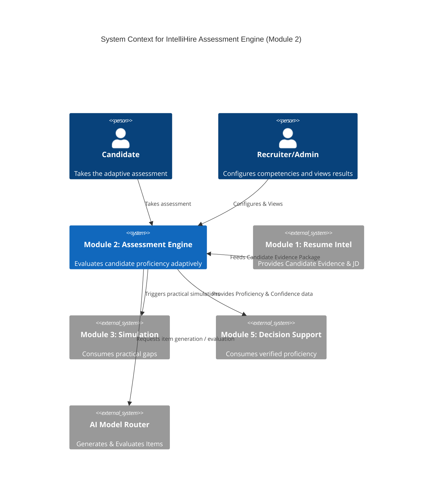

# Module 2: Executive Summary & System Contracts
**STATUS: PROPOSED / NOT APPROVED**

## 1. Executive Summary & Scope
Module 2 is a universal, evidence-based assessment engine designed to evaluate candidates across all roles, industries, seniority levels, and skill domains. It is **not** a generic quiz generator or a coding-only platform. Instead, it dynamically synthesizes candidate evidence (from M1), the target job description (JD), and universal competency frameworks to generate an adaptive, explainable proficiency profile.

**Key Paradigms:**
*   **Universal Applicability:** Must support software engineering, healthcare, trades, sales, creative roles, etc.
*   **Explainability:** Every question asked must possess a traceable "why" (e.g., tying back to a specific JD requirement or validation of a claimed skill).
*   **Multidimensional Proficiency:** Output is not a single raw score, but a profile representing Knowledge, Reasoning, Application, Practical Performance, and Consistency, accompanied by *Confidence/Uncertainty* metrics.

## 2. Module Interfaces

### Module 1 → Module 2 Contract
Module 2 receives a versioned **Candidate Evidence Package** from M1.
*   **Inputs:** Extracted candidate profile, normalized experience, claimed skills, missing/contradictory info, target JD, ATS match analysis.
*   **Critical Distinction:** M1's optimized resume is treated as a *claim*, not verified proof. Module 2's job is to transition skills from *claimed/inferred* to *demonstrated/assessed*.

### Module 2 → Module 3, 4, 5 Contracts
*   **To Module 3 (Domain/Tech Simulation):** Passes the updated skill proficiency estimates, confidence intervals, and identified practical gaps (e.g., "Knowledge is adequate; performance should be tested in simulation").
*   **To Module 4 (Behavioral Simulation):** Passes identified behavioral/communication competencies required by the JD that require validation.
*   **To Module 5 (Decision Support):** Passes the final synthesized evidence package. M5 requires the separation of *Proficiency* vs *Confidence* to prevent over-indexing on low-confidence assessments.

## 3. C4 System Context Diagram

