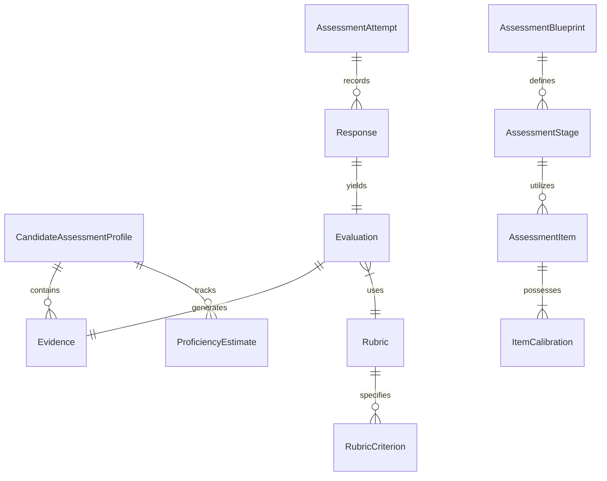

# Module 2: Data, Roles & Competency Models
**STATUS: PROPOSED / NOT APPROVED**

## 1. Canonical Competency Hierarchy
To support cross-industry assessment, the system uses a configurable **Framework Adapter Layer** mapped to credible sources (O*NET, ESCO, NICE, SFIA). 

**Hierarchy:**
`Occupation/Role` → `Competency` → `Skill` → `Subskill` → `Knowledge Area` → `Task/Activity` → `Assessment Item` → `Evidence`

This hierarchy allows a role (e.g., "Senior Nurse") to map to an industry framework, inherit competencies, and align with specific tasks. 

## 2. JD → Competency Profile & Candidate Profiling
*   **JD Extraction:** The AI extracts mandatory/preferred skills, domain requirements, and professional behaviors, mapping them to the canonical hierarchy.
*   **Candidate Profile:** Constructed from M1. Each skill has an `EvidenceState`: Claimed, Demonstrated, Verified Credential, Unknown, or Contradicted.

## 3. Seniority Model
Seniority is modeled across dimensions of complexity, rather than just "harder trivia questions."
*   **Junior:** Focuses on foundational execution and declarative knowledge.
*   **Senior/Lead:** Focuses on ambiguity resolution, system thinking, trade-offs, and risk management.

## 4. Conceptual Data Model
*(No actual tables implemented yet)*

### Key Entities
*   **AssessmentBlueprint:** A versioned definition of what to test, derived from the JD and candidate gaps.
*   **ItemCalibration:** Tracks difficulty, discrimination, and exposure of questions over time.
*   **ProficiencyEstimate:** A multidimensional value representing a candidate's capability and the system's *ConfidenceEstimate*.
*   **Rubric:** Reusable scoring instructions for AI evaluators or human graders.
