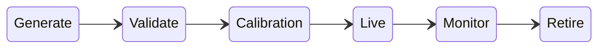

# Module 2: Adaptive Engine & Assessment Lifecycle
**STATUS: PROPOSED / NOT APPROVED**

## 1. Traceability: "Why is this question being asked?"
No item is randomly selected. The AI generated metadata must map explicitly:
`Question` → measures `Skill` → contributes to `Competency` → required for `Role/JD` → serves `Assessment Objective` (e.g., "Gap Validation").

## 2. Assessment Stages (Proposed)
1.  **Stage 0 - Diagnostic:** Establishes baseline.
2.  **Stage 1 - Foundation:** Prerequisite knowledge.
3.  **Stage 2 - Core Role Skills:** Central competencies.
4.  **Stage 3 - Applied Skills:** Scenario-based reasoning.
5.  **Stage 4/5 - Advanced & Real-World Simulation:** Deep complexity / practical tasks.
6.  **Stage 6 - Gap Validation:** Targeting high-uncertainty areas.
7.  **Stage 7 - Final Profiling:** Synthesis of all evidence.

## 3. Adaptive Methodology
Instead of assuming a basic 3PL Item Response Theory (IRT) model which fails in cold-start scenarios, the engine will use a **Bayesian Knowledge Tracing (BKT)** or **Hybrid Multi-Dimensional Ability Model**. 
*   **Cold Start:** Uses rubric-based heuristic routing.
*   **Mature Items:** Uses IRT difficulty and discrimination parameters based on `ItemCalibration` data.

### Adaptive Transitions
*   **Advance:** Evidence confidence threshold reached.
*   **Remediate/Branch:** Prerequisite failure detected; drop to foundational concepts.
*   **Practicalize:** Knowledge verified; trigger work-sample simulation.
*   **Terminate:** Sufficient evidence gathered for objective.

## 4. Question Generation & Lifecycle
AI-generated questions do not automatically enter live assessments.
1.  **Generate:** (via Medium workload AI).
2.  **Validation:** (Structural, ambiguity, fairness, correctness).
3.  **Human Review / Auto-Calibration:** Seeded as ungraded "beta" questions in live tests to gather calibration data.
4.  **Publish:** Added to active adaptive selection pool.
5.  **Monitor & Retire:** Removed if differential item functioning (bias) or leakage is detected.

## 5. Scoring & Confidence
*   **Multidimensional Score:** Separates declarative knowledge from practical application.
*   **Confidence Intervals:** Distinguishes "High proficiency with low confidence" (needs more items) from "High proficiency with high confidence" (terminate assessment).
